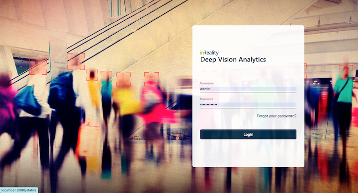
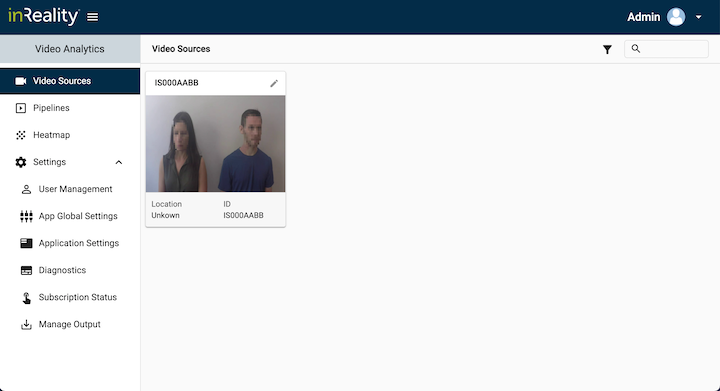
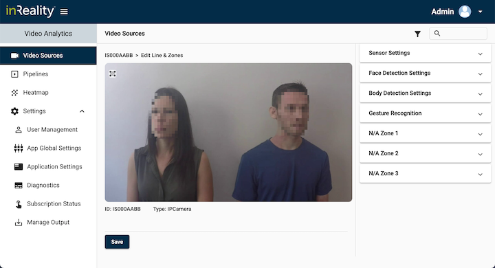
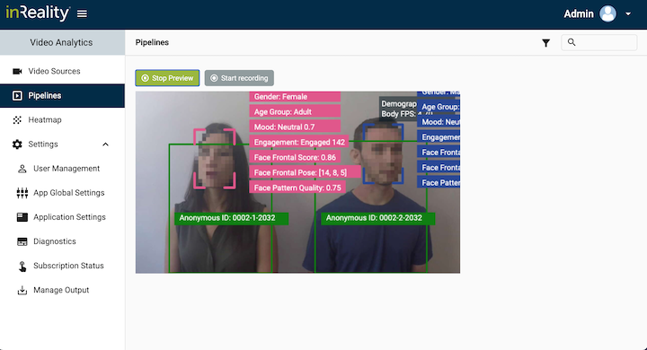

```text
SPDX-License-Identifier: Apache-2.0
Copyright (c) 2021 InReality LLC
```

<h1>InReality DLAV</h1>
<p>
InReality's Deep Learning Anonymous Analytics Engine helps companies with their vision based analytical needs by providing user-friendly user inferface and superior user experience. The engine comes with pluggable best-in-class detection AI models built-in.
</p>
<p>
Now DLAV is more accessible than ever by making it available through Intel's OpenNess platform. You just have to use the helm chart provided to deploy our DLAV into your own environment.
</p>
<h1>Technical Details</h1>

## **Pre Requisites – Resources Required**

| **Resource Information**           |                      |
|------------------------------------|----------------------|
| Application Type                   | Video-Analytics		| 
| Compute  (vCores)                  | 8                    |  
| Memory (RAM)                       | 16 GB                |  
| Storage 				       | 100  GB              |  
| Host OS                            | CentOS 7-9.2009      | 
  
## **Where to Purchase**
Contact sales@inreality.com


## Pre Requisites - Installing OpenNESS
|**Configuration**                   |                       |
|  ----------------------------------|-----------------------|
| OpenNESS Version                   | 21.03		         |
| Flavor Used 					     | media-analytics			 |
| Distribution						 | IDO    	     |


Follow below link to setup controller and edge-node for installing OpenNESS.

https://github.com/open-ness/specs/blob/master/doc/getting-started/openness-cluster-setup.md


<h2>Loading Docker Images</h2>
<p>
The base image is available at dockerhub <a href="https://hub.docker.com/r/irllc/ava-gst">https://hub.docker.com/r/irllc/ava-gst</a>. This is a public image made available by InReality LLC.
</p>
<p>
Do take note that you would need a license from InReality LLC in order to run this image successfully. 
You can contact us at <a href="mailto:sales@inreality.com?">Sales at InReality</a> to request for you license today.
</p>


<h2>Helm Chart</h2>
<P>
Helm chart is also available for easier deployment. The helm chart is under the deploy/ folder.
</P>

## Installing <application name> using helm

Run the following commands to deploy  through helm:

`helm install ava-gst ./deploy/`

 Sample Output would look like:

> `helm install ava-gst ./deploy/`
>
> `NAME: ava-gst`
>
> `LAST DEPLOYED: Wed Sep  8 00:39:50 2021`
>
> `NAMESPACE: default`
>
> `STATUS: deployed`
>
> `REVISION: 1`
>
> `NOTES:`
>
> `ava-gst installed`	


## Uninstall <application name> application
To uninstall application run below command:

helm delete ava-gst

## Testing Steps
For further instructions about steps for testing, contact us (dev@inreality.com)

## **Related material**
* https://www.inreality.com/
     
<h2>Application Information</h2>
Our application is available through your browser using this <a href="http://localhost:8080/">local web page link</a>. Click on this link after you ran your Helm Chart successfully.
<br />
<h1>Important Notes</h1>
<h2>License</h2>
  
| Field         | Sample Value                                 | Notes.   |
| ------------- | ----------------------                       | -------  |
| url           | https://float-license-dev.inreality.com/     | Request. |
| account       | wlSTH9iXZKDg8NggJJ0000                       | Request. |
| api_key       | ei2A4oR-YkL1Z73Z68wDA5WJBW6yUffEPE2eeeeqqes  | Request. |
| license_key   | Fn04W-nSt66UTMZj6WyFyueIUZZLwDO0Npmgym8yzXc  | Request. |


<h1>Screenshots</h1>
<h2>Entry Page</h2>




<h2>Video Source</h2>



<h2>Video Sources Editing</h2>



<h2>Live Preview</h2>




