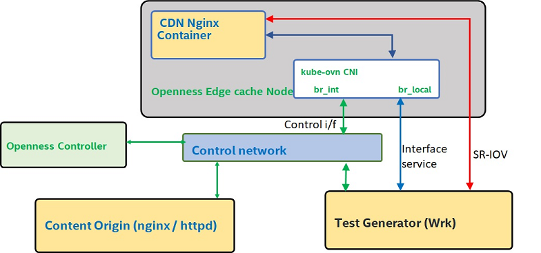

```text
SPDX-License-Identifier: Apache-2.0
Copyright (c) 2020 Intel Corporation
```
<!-- omit in toc -->
# CDN Application in OpenNESS
This sample application demonstrates CDN (Content Delivery Network) deployment and execution on the OpenNESS edge platform.

- [NGINX based CDN Application Deployment](#nginx-based-cdn-application-deployment)
- [Onboarding nginx based CDN application](#onboarding-nginx-based-cdn-application)
  - [Prerequisites](#prerequisites)
  - [Setting up Networking Interfaces](#setting-up-networking-interfaces)
    - [Setting up kubeovn interface](#setting-up-kubeovn-interface)
    - [Setting up the SR-IOV interface](#setting-up-the-sr-iov-interface)
  - [Deploying the Application](#deploying-the-application)
  - [Custom SSL certificate keys for the nginx](#custom-ssl-certificate-keys-for-the-nginx)
  - [Testing using wrk](#testing-using-wrk)


## NGINX based CDN Application Deployment
NGINX is configured to function as a Content Delivery Network. This section describes the deployment of nginx based CDN on an openNESS platform using helm charts and testing the CDN.

## Onboarding nginx based CDN application
The purpose of this section is to guide the user on the complete process of onboarding the nginx based CDN application. This process will also guide the user on setting up network connection between test machine and the application.

### Prerequisites

* OpenNESS for Network Edge is fully installed and set up.
* A separate host used for generating traffic. wrk can be used for generating mutiple parallel http requests.
* The Edge Node host and traffic generating host are connected together point to point via unused physical network interfaces.

### Setting up Networking Interfaces
The nginx based CDN application can use the following network interface types for the data / content delivery,

* k8s control interface - using kubernetes control interface.
* direct Kubeovn interface - using interfaceservice option
* direct sriov interface



_Figure - Sample CDN test Setup and possible n/w interfaces with OpenNESS_

The required interface option can be selected by specifying the proper keys and values via the helm install command line.
Extra setup is not required when using the control interface for data / content traffic, as the required (service) resources are created automatically by the helm during installation.

#### Setting up kubeovn interface
1. On the test machine / host, configure the network interface connected to Edge Node host. External client traffic in OpenNESS Network Edge configuration is routed via 192.168.1.1, the IP address of traffic generating host must be one from same sub-net. Configure the routing accordingly:
   ```
   ip a a 192.168.1.10/24 dev <client_interface_name>
   route add -net 10.16.0.0/24 gw 192.168.1.1 dev <client_interface_name>
   ```

   > **NOTE:** The subnet `192.168.1.0/24` is allocated by Ansible playbook to the physical interface which is attached to the first edge node. The second edge node joined to the cluster is allocated the next subnet `192.168.2.0/24` and so on.

   > **NOTE:** To identify which subnet is allocated to which node, use this command:
   >  ```shell
   >  $ kubectl get subnets
   >  NAME             PROTOCOL   CIDR             PRIVATE   NAT     DEFAULT   GATEWAYTYPE   USED   AVAILABLE
   >  jfsdm001-local   IPv4       192.168.1.0/24   false     false   false     distributed   0      255
   >  jfsdm002-local   IPv4       192.168.2.0/24   false     false   false     distributed   0      255
   >  ...
   >  ```
   >
   > The list presents which subnet (CIDR) is bridged to which edgenode, e.g: node `jfsdm001` is bridged to subnet `192.168.1.0/24` and node `jfsdm002` is bridged to subnet `192.168.2.0/24`

   > **NOTE:** Ingress traffic originating from `192.168.1.0/24` can *only* reach the pods deployed on `jfsdm001`, and similarly for `192.168.2.0/24` can reach the pods deployed on `jfsdm002`.

2. From the Edge Controller, set up the interface service to connect the Edge Node's physical interface used for the communication between Edge Node and test machine, to OVS. This allows the test machine to communicate with the CDN application K8s Pod located on the Edge Node (sample output separated by `"..."`, PCI Bus Function ID of the interface used my vary).
   ```
   kubectl interfaceservice get <edge_node_host_name>
   ...
   0000:86:00.0  |  3c:fd:fe:b2:42:d0  |  detached
   ...

   kubectl interfaceservice attach <edge_node_host_name> 0000:86:00.0
   ...
   Interface: 0000:86:00.0 successfully attached
   ...

   kubectl interfaceservice get <edge_node_host_name>
   ...
   0000:86:00.0  |  3c:fd:fe:b2:42:d0  |  attached
   ...
   ```
  3. To enable the kube-ovn interface, set the helm key "sriov" to false and also set the "numNodes" to the number of available nodes in the cluster. The numNodes is used to generate the network policy resources to be used in the openNESS platform.

#### Setting up the SR-IOV interface

1. Please refer to the link for setting up the SR-IOV interface: [Setting up SR-IOV for network edge](https://github.com/otcshare/specs/blob/master/doc/enhanced-platform-awareness/openness-sriov-multiple-interfaces.md#sriov-for-network-edge)

2. Set the "sriov" helm key to "True" to enable the sriov annotations and NFD features in the deployment specification.

### Deploying the Application

Helm is used to deploy the CDN application. Please refer to [Helm website](https://helm.sh/) for further details.
Clone the edgeapps repo and the nginx based CDN helm chart is available under "applications/cdn-caching/nginx/".

> **Note:** The values.yaml file contain the key and default values used to customize the templates, during the helm deployment. Comments that explain the roles of the keys and their possible vaues are added in the values.yaml file. The example folder will contain further example values files.

> **Note:** Provide the proper values for the origin server and the disk storage locations, where the contents need to be cached.

### Custom SSL certificate keys for the nginx

The ssl certificates for the nginx, can be passed in the command line as below, during application deployment.

```shell
helm install -f <path-to-optional-user-values-file> --set-file nginx.http.server.ssl_cert_file=<path-to-certificate-file> --set-file nginx.http.server.ssl_key_file=<path-to-key-file> <release-name> <path-to-helm-chart>

# example
helm install -f ./examples/sriov_nginx_values.yaml  --set-file nginx.http.server.ssl_cert_file=$PWD/nginx.crt --set-file nginx.http.server.ssl_key_file=$PWD/nginx.key openness-cdn ./helm/
```
### Testing using wrk
"wrk" tool can be used for generating multiple http requests. Hence it will be used to test the CDN.
```shell
./wrk -t56 -c100 -d60s http://10.16.0.12/bigfile
```
Here is an example output
```
Running 1m test @ http://10.16.0.12/bigfile
  56 threads and 100 connections
  Thread Stats   Avg      Stdev     Max   +/- Stdev
    Latency     3.97ms    3.48ms 218.35ms   88.65%
    Req/Sec   262.19    130.81     2.65k    79.33%
  877266 requests in 1.00m, 65.55GB read
Requests/sec:  14596.88
Transfer/sec:      1.09GB
```
> **Note** The wrk tool can be installed in a CentOS traffic host machine using the following steps,
```
	yum groupinstall 'Development Tools'
	yum install -y openssl-devel git
	git clone https://github.com/wg/wrk.git wrk
	cd wrk
	make
	# move the executable to somewhere in your PATH
	cp wrk /somewhere/in/your/PATH
```
