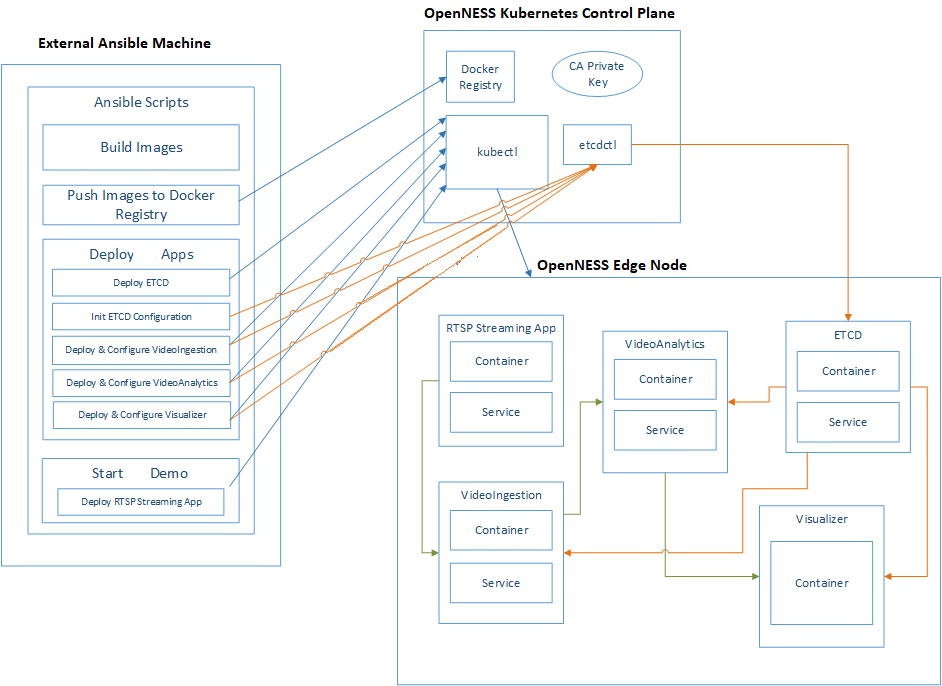

```text
SPDX-License-Identifier: Apache-2.0
Copyright (c) 2020 Intel Corporation
```

# EIS Applications with OpenNESS
The purpose of this source code is to deploy EIS applications on OpenNESS platform.

Edge Insights Software (EIS) is the framework for enabling smart manufacturing with visual and point defect inspections.

More details about EIS:  
[https://www.intel.com/content/www/us/en/internet-of-things/industrial-iot/edge-insights-industrial.html](https://www.intel.com/content/www/us/en/internet-of-things/industrial-iot/edge-insights-industrial.html)

Currently, `eis-experience-kit` supports EIS in version 2.2.

- [OpenVINO](#openvino)
- [Pre-requisites](#pre-requisites)
- [Installation Process](#installation-process)
    - [Getting The Sources](#getting-the-sources)
    - [Build Stage](#build-stage)
    - [Deploy Stage](#deploy-stage)
    - [Cleanup](#cleanup)
- [Configuration](#configuration)
    - [Getting Sources Settings](#getting-sources-settings)
    - [Build Settings](#build-settings)
    - [Deploy Settings](#deploy-settings)
    - [Inventory](#inventory)
    - [Playbook Main File](#playbook-main-file)
- [Installation](#installation)
- [Removal](#removal)
- [References](#references)

## OpenVINO
EIS requires OpenVINO Toolkit to be downloaded and installed. It is automated and no user input is required.

More about OpenVINO Toolkit: [https://docs.openvinotoolkit.org/](https://docs.openvinotoolkit.org/)

## Pre-requisites
EIS applications require Network Edge OpenNESS platform to be deployed and working.

## Installation Process
The major part of this repository is Ansible scripts set. They are used for EIS application build and deployment. Most of the roles are split into two stages - build and deploy. The first part is performed on the same host as Ansible scripts and the second one is run on OpenNESS Master Node.

User can manage which components will be executed during the deployment.

### Getting The Sources
`eis-experience-kit` supports two ways of getting EIS sources. User can choose between cloning the repository from Git and use release package.

To use the release package, user should get it manually and the path to it should be passed in `host_vars/localhost.yml` file in field `release_package_path`. The package will be extracted and source code will be used in the same way as repository.

The release package can be downloaded here: [https://software.intel.com/content/www/us/en/develop/topics/iot/edge-solutions/industrial-recipes.html](https://software.intel.com/content/www/us/en/develop/topics/iot/edge-solutions/industrial-recipes.html)

### Build Stage
Overview on `eis-experience-kit` architecture:



All the `build` tasks are perfomed on `localhost`. It is the same machine that Ansible Playbook is run on. These tasks contain installation of all required prerequisites for building the applications images and all steps related to building docker images. All images, after successful build, are tagged and pushed to the Docker Registry that is a part of OpenNESS platform. They will be used by Kubernetes later, in `deploy` stage. 

### Deploy Stage
`Deploy` tasks are executed on OpenNESS Master Node. These tasks include ETCD certificates and ZMQ keys generation process and adding apps configs to ETCD. All these things are done just before the particular application has been deployed. For the deployment `kubectl` command and Kubernetes manifest files have been used. 

### Cleanup
All the roles in Ansible Playbook have clean up scripts that can be run to reverse the build and deploy tasks. It should be used only for debug purposes. It is not guarantee that clean up scripts will remove everything that has been added by build & deployment stages. In the most cases it is enough for running the deployment of particular application or the whole EIS again. `cleanup_eis_pcb_demo.sh` is a shell scripts that is running a sequence of cleaning tasks that should cover all the `deploy_eis_pcb_demo.sh` changes on the setup.

## Configuration
User can configure the installation of EIS by modifying the files that contain variables used widely in Ansible Playbook. All the variables that can be adjusted by the user are placed in `host_vars` directory.

### Getting Sources Settings
`eis-experience-kit` supports two ways of getting sources. It can be done by cloning the repository using git or use pre-downloaded release package. The first one can be chosen by setting `eis_source` to `gitclone`. User needs to be authorized to clone the repo from Gitlab and may be asked for credentials (or ssh key needs to be added to the Gitlab account). The second one requires `eis_source` to be set to `release` and `release_package_path` to be set to the release package path. Then package will be automatically extracted and used by Ansible scripts. These settings are available in `host_vars/localhost.yml`.

### Build Settings
`localhost.yml` file contains all the settings specific for build process that is performed on localhost. User can set proxy settings and how the EIS sources will be handled.

### Deploy Settings
The second one is regarding the `deploy` process. All the settings are in `openness_controller.yml` file. It is for the action that will occur on OpenNESS Master Node. It contains mostly the values for certificates generation process and paths for Kubernetes deployment related files.

### Inventory
User needs to set the OpenNESS Master Node IP address. It can be done in `inventory.ini` file.

### Playbook Main File
The main file for playbook is `eis_pcb_demo.yml`. User can define here which roles should be run during the build & deployment. They can be switch by using comments for unnecessary roles.

## Installation
After all the configuration is done, script `deploy_eis_pcb_demo.sh` needs to be executed to start the deployment process. No more actions are required, all the installation steps are fully automated. 

## Removal
To clean up the platform from EIS applications `cleanup_eis_pcb_demo.sh` script can be used. It runs Ansible playbook `eis_pcb_demo_cleanup.yml` and processes all the roles defined there. Inventory file is used for getting Controller Node IP.

## References
- [Industrial Edge Insights Application on OpenNESS - Solution Overview](https://github.com/otcshare/specs/blob/master/doc/applications/openness_eis.md)
- [Intel’s Edge Insights for Industrial](https://www.intel.com/content/www/us/en/internet-of-things/industrial-iot/edge-insights-industrial.html)
