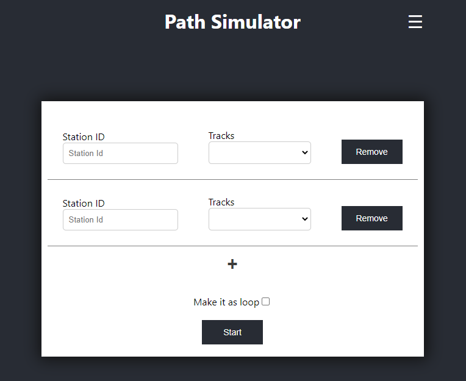

[Creative Commons Attribution-NonCommercial-NoDerivatives 4.0 International Public License](https://creativecommons.org/licenses/by-nc-nd/4.0/legalcode)

(CC) 2020 [LINKS Foundation](https://linksfoundation.com/)

# MEC Location API simulator 

- [MEC Location API simulator](#mec-location-api-simulator)
	- [Application Description](#application-description)
	- [Repository content](#repository-content)
	- [Pre Requisites](#pre-requisites)
	- [Installation](#installation)
		- [Load docker images locally](#load-docker-images-locally)
		- [Install the MEC Location API Service](#install-the-mec-location-api-service)
		- [Start a simulation](#start-a-simulation)
		- [Install consumer sample application](#install-consumer-sample-application)
	- [How do I develop my MEC Application?](#how-do-i-develop-my-mec-application)

Application Description
---
The Application is a Location API Simulator registered to OpenNESS platform as producer application. It provides a MEC Location Service accessible via Location API as specified in the ETSI GS MEC013 document, appearing as a RESTful web service. It has a Graphical User Interface enabling developers to simulate mobile users' movements by feeding the simulator with a GPS track in .gpx format.  

Repository content
---
The repository contains a *freeware* version of MEC Location API developed by LINKS Foundation, including:

-	Docker container of the Location API 
-	Helm package for the installation
- 	Docker container of a sample consumer application, for testing the Location API service
-	YAML file for the consumer deploy

Pre Requisites
---
The application has been tested on the following software, which is also required:

* [OpenNESS](https://github.com/open-ness/specs) Network Edge 
* Kubernetes v1.18.4
* Helm v3.1.2

Installation
----

> The installation switches between *Controller* and *Edge* node. Keep attention on where each step has to be performed!

### Load docker images locally
The repository contains two docker images, one for the MEC Location API Simulator named `location-api:v2.1.1`; the second one for the Location API consumer sample, named `location-api-consumer:latest`. In order to proceed to the following steps, both images have to be loaded on the *Edge Node*. If you want, you can avoid loading the Location API consumer sample, since it is just for testing the simulator. 

Load the images on the **Edge Node** with the following commands: 
```sh
$ docker load < location-api.tar.gz
$ docker load < location-api-consumer.tar.gz
```
> You might need to add `sudo` command, it depends on you docker installation settings and permissions. 

Then, check if both images have been loaded with the `$ docker images` command. 

### Install the MEC Location API Service 

The installation proccess leverage on helm chart. So, assuming that the Location API Simulator docker image has been loaded, moving to the *Controller Node*, go to the `helm`  folder of the repository, and type:

```sh
$ helm install links-location-api links-location-api/ --values links-location-api/values.yaml --set env[0].name=NODE_IP --set env[0].value="<edge-node-ip>" --set env[1].name=NODE_PORT_SIMULATOR --set env[1].value="<edge-node-port>"
```

Notice two variables: 

- NODE_IP=`<edge-node-ip>`
- NODE_PORT_SIMULATOR=`<edge-node-port>`

Both variables have to be inserted according to the **IP address** of the Edge Node in which you want to run the installation and the **public port** for exposing GUI.
> According to the Kubernetes [documentation](https://kubernetes.io/docs/concepts/services-networking/service/#nodeport), the Kubernetes control plane allocates a **port from** a range 30000-32767, so you need to choose a port in that specified range.

If the installation succeds, test it either opening a browser to `<ip-address>:<edge-node-port>` for seeing the GUI or typing in a terminal the command `$ curl <ip-address>:<edge-node-port>`.  

### Start a simulation
The GUI allows to start a simulation. Going to `<ip-address>:<edge-node-port>`, you will see the GUI, which should look like the following: 



The GUI allows to create and simulate the movement of mobile devices through a given path or track. The track must be a well-formed GPX file, and it must include at least *coordinates* and the relative *timestamp*, like the following: 

```xml
<?xml version="1.0" encoding="utf-8" standalone="yes"?>
<gpx version="1.0" creator="GPS Visualizer https://www.gpsvisualizer.com/" xmlns="http://www.topografix.com/GPX/1/0" xmlns:xsi="http://www.w3.org/2001/XMLSchema-instance" xsi:schemaLocation="http://www.topografix.com/GPX/1/0 http://www.topografix.com/GPX/1/0/gpx.xsd">
	<trk>
  		<name>sample</name>
  		<trkseg>
			<trkpt lat="45.072883333" lon="7.78415">
				<time>2013-01-30T15:41:38.9Z</time>
			</trkpt>
			<trkpt lat="45.0729" lon="7.784133333">
				<time>2013-01-30T15:41:39Z</time>
			</trkpt>
			<!-- other track points here -->
		</trkseg>
	</trk>
</gpx>
```

> In the beginning, the simulator contains just one GPX file as a sample, but you can add as many GPX files as you want, going to the *Upload file* section. In the upper right, from the menu, you can go there and upload it. Then, it will be available in the *home* section. 

For starting a simulation you need to: 

- write down a name for each *`Station ID`* and select a GPX file from the dropdown list
- add as many *`Station ID`* as you want to simulate
- choose if make the simulation iteratively *`Make it as loop`* or run just once
- click on button *`Start`*

The simulator will start feeding location information to the Location API service.

### Install consumer sample application 
The consumer sample application can be easily deployed through the provided YAML file. The YAML file is the simplest one, but it has a *mandatory*  field that enables the communication from *Location API Simulator Pod* and *Location API consumer Pod*. Below, the YAML file is shown: 

```yaml
apiVersion: v1
kind: Pod
metadata:
    name: consumer
    labels:
  		locationService: active
spec:
	containers:
	-
		image: "location-api-consumer:latest"
		imagePullPolicy: Never
		name: consumer
		ports:
			- containerPort: 8082
```

Therefore, the label `locationService: active` **must be included** for using the Location API Simulator. All the other labels can be changed according to the proper needs.

From the *Controller Node*, execute the following command: 

```sh
$ kubectl create -f consumer.yaml
```

and check if it is running:

```sh
$ kubectl get pods 
```

Then, check the logs:

```sh
$ kubectl logs -f location-api-consumer 
```
If it is correctly started and you started the simulation in the section [above](#start-a-simulation) you will see location related information received from Location API Simulator.

## How do I develop my MEC Application?

For developing your own MEC Application, you need to go through the following steps: 

1. Create a procedure for the registration of your application to the OpenNESS EAA, as described [here](https://github.com/open-ness/specs/blob/master/doc/applications-onboard/network-edge-applications-onboarding.md)
2. Create your own docker image, which has to be build or loaded to the *Edge Node*. Inside the docker container, you will need to automate the registration process of the previous point
3. Create a YAML file in the *Controller Node* associated with the docker image (similar to the example above - [Install consumer sample application](#install-consumer-sample-application)). 
