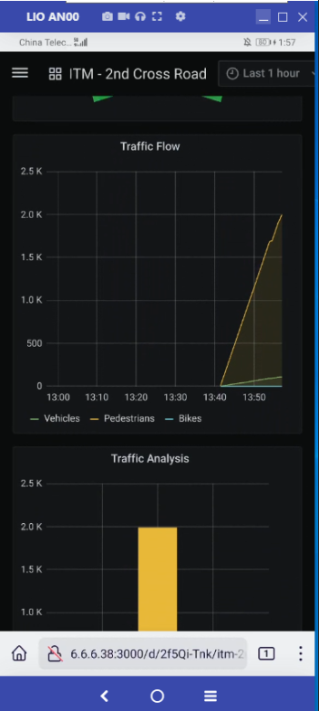

```text
SPDX-License-Identifier: Apache-2.0
Copyright (c) 2022 Intel Corporation
```
# WNR-ITM application with Smart Edge Open Private Wireless Experience Kit 
The purpose of this source code is to deploy WNR-ITM (Wireless Network Ready Intelligent
Traffic Management Application) applications on Smart Edge Open Private Wireless Experience Kit which is for 5G network platform.

This document provides the procedure to deploy the Wireless Network Ready Intelligent
Traffic Management Application.

- [Overview](#overview)
- [Pre-requisites](#pre-requisites)
- [Installation Process](#installation-process)
    - [Getting the Sources](#getting-the-sources)
    - [unzip the WNR-ITM package](#unzip-the-wnr-itm-package)
    - [Download components of WNR-ITM](#download-components-of-wnr-itm)
    - [Check the ITM Dockerfile](#check-the-itm-dockerfile)
    - [Dry-run check patching](#dry-run-check-patching)
    - [Apply the patch](#apply-the-patch)
- [Build and deploy ITM](#build-and-deploy-itm)
    - [Build Grafana and ITM images](#build-grafana-and-itm-images)
    - [Apply NetworkAttachmentDefinition](#apply-network-attachment-definition)
    - [Apply the network policy](#apply-the-network-policy)
    - [Deploy Grafana and Influxdb](#deploy-grafana-and-influxdb)
    - [Deploy the ITM application](#deploy-the-itm-application)
    - [Start the nginx service in the Grafana pod](#start-the-nginx-service-in-the-grafana-pod)
    - [Add routing rule for Grafana](#add-routing-rule-for-grafana)
- [Result](#result)
- [Points to Consider](#points-to-consider)

## Overview
The following diagram provides overview of the WNR ITM application in Smart Edge Open Private Wireless Experience Kit.


## Pre-requisites
- The Smart Edge Open Private Wireless Experience Kit is deployed as per release notes of Smart Edge Open Private Wireless Experience Kit.

- Install the patch tool if not installed before
	```sh
	$ yum install -y patch
	```

## Installation Process
The following steps provides the detail to install the WNR-ITM application on Smart Edge Open Private Wireless Experience Kit.
Please note that the installation is done from the controller node while some configurations are done in the edge node during the installation and bringup.

### Getting the Sources

Download the WNR ITM v3.0.0 from the following URL
https://www.intel.com/content/www/us/en/developer/articles/reference-implementation/wireless-network-ready-intelligent-traffic-management.html

Note: Follow the steps mentioned in the URL to download the package.

Copy the package (wireless-network-ready-pcb-defect-detection.zip) to the K8S Control plane node and extract the ITM installation code.
 
### unzip the WNR-ITM v3.0.0
Unzip the downloaded zip package to start the installation in the Controller node.

```sh
$ unzip wireless_network_ready_intelligent_traffic_management.zip
$ cd wireless_network_ready_intelligent_traffic_management
```
 
### Download components of WNR-ITM
Download and extract the WNR ITM components to deploy the application using the edgesoftware executables.

```sh
$ chmod +x edgesoftware
$ ./edgesoftware download
$ cd Wireless_NetworkReady_Intelligent_Traffic_Management_21.03
$ cd Wireless_NetworkReady_Intelligent_Traffic_Management
```
> Copy the wnr_itm_for_pwek.patch from wnr-itm-app folder to the Wireless_NetworkReady_Intelligent_Traffic_Management folder

### Check the ITM Dockerfile
```sh
$ cat WNR_ITM/ITM/Dockerfile |grep "RUN git checkout 2021.2"
# If can get the output, please delete "RUN git checkout 2021.2", and modify command "RUN git clone https://github.com/openvinotoolkit/open_model_zoo.git" to "RUN git clone -b 2021.2 https://github.com /openvinotoolkit/open_model_zoo.git". if can't get output, please ignore this step.
```


### Dry-run check patching

In case of warning/errors check the current working directory.
```sh
$ patch -p1 --dry-run < ./wnr_itm_for_pwek.patch
checking file WNR_ITM/ITM/app/server.py
checking file WNR_ITM/deploy/grafana/templates/deployment.yaml
checking file WNR_ITM/deploy/influxdb/templates/deployment.yaml
checking file WNR_ITM/deploy/itm/templates/deployment.yaml
checking file WNR_ITM/deploy/itm/values.yaml
checking file WNR_ITM/grafana/Dockerfile
```

### Apply the patch
This step is required to apply the customization required for the WNR-ITM application to work on the Smart Edge Open Private Wireless Experience Kit.

Apply the patch if the above dry-run check is successful. 

```sh
$ patch -p1  <./wnr_itm_for_pwek.patch
patching file WNR_ITM/ITM/app/server.py
patching file WNR_ITM/deploy/grafana/templates/deployment.yaml
patching file WNR_ITM/deploy/influxdb/templates/deployment.yaml
patching file WNR_ITM/deploy/itm/templates/deployment.yaml
patching file WNR_ITM/deploy/itm/values.yaml
patching file WNR_ITM/grafana/Dockerfile
```

## Build and deploy the ITM application

### Build Grafana and ITM images

```sh
# build Grafana image
$ cd WNR_ITM/grafana
$ chmod +x ./build-image.sh
$ ./build-image.sh
```
> Note: please copy Grafana image to the cluster node.

```sh
# build ITM image
$ cd WNR_ITM/ITM
$ chmod +x ./build-image.sh
$ ./build-image.sh
```

### Apply Network Attachment Definition
The network attachment file "net-sriov-itm.yaml" is provided as part of this application.

```sh
# create Network Attachment Definition
kubectl create -f net-sriov-itm.yaml
```

### Apply the network policy
The network policy file "itm_network_policy.yaml" is provided as part of this application.

```sh
# create netpol for the ITM
kubectl create -f itm_network_policy.yaml
```

### Deploy Grafana and Influxdb
The helm is used to deploy the Grafana and Influxdb pods.

```sh
cd WNR_ITM/deploy
helm install grafana ./grafana
helm install influxdb ./influxdb

# check the Grafana and Influxdb pod
kubectl get pod -n smartedge-apps

NAME                        READY   STATUS    RESTARTS   AGE
grafana-796b7f677-lsrh4     1/1     Running   0          44h
influxdb-585c4b8bb5-8f2lc   1/1     Running   0          44h
```

### Deploy the ITM application
Execute the following commands in the controller node to deploy the application.

```sh
# Get the Grafana sriov ip
grafana_pod=$(kubectl get pod -n smartedge-apps |grep grafana | awk '{print $1}')
sriov_IP=$(kubectl exec -n smartedge-apps ${grafana_pod} -- ip a s net1 | grep inet |awk '{print $2}' | cut -d '/' -f 1)
 
# helm install ITM
cd WNR_ITM/deploy
Cluster_ControllerIP=$(kubectl get node -o wide |grep control-plane | awk '{print $6}')
helm install itm ./itm --set hostIP=${Cluster_ControllerIP} --set sriovIP=${sriov_IP}
 
# check the ITM pod
kubectl get pod -n smartedge-apps

NAME                   READY   STATUS    RESTARTS   AGE
itm-75758c684f-cdxt5   1/1     Running   0          44h
```
> NOTE: <Cluster_ControllerIP> is the cluster controller ip.

### Start the nginx service in the Grafana pod
Start the nginx service by executing the following commands in the controller node.

```sh
kubectl exec -n smartedge-apps ${grafana_pod} -- sed -i "s/try_files \$uri \$uri\/ =404;/proxy_pass http:\/\/${Cluster_ControllerIP}:30300;/"  /etc/nginx/sites-available/default
kubectl exec -n smartedge-apps ${grafana_pod} -- nginx -g "daemon on;"
```
> NOTE: <Cluster_ControllerIP> is the cluster controller ip.


### Add routing rule for Grafana
In the edge node perform the following commands to add an additional rule for Grafana.

```sh
# Login the edge node, and add an additional route rule for Grafana
[root@node]# docker ps | grep k8s_grafana_grafana* | awk '{print $1}'
32e0eade6b0d

[root@node]# docker inspect -f {{.State.Pid}} 32e0eade6b0d
86372
[root@node]# nsenter -n -t 86372

[root@node]# route add -net 195.168.1.0 netmask 255.255.255.0 gw 6.6.6.1

[root@node]# route
Kernel IP routing table
Destination     Gateway         Genmask         Flags Metric Ref    Use Iface
default         gateway         0.0.0.0         UG    0      0        0 eth0
6.6.6.0         0.0.0.0         255.255.255.0   U     0      0        0 net1
gateway         0.0.0.0         255.255.255.255 UH    0      0        0 eth0
195.168.1.0     6.6.6.1         255.255.255.0   UG    0      0        0 net1
```
> NOTE: The subnet 195.168.1.0/24 is the UE (User Equipment) network segment allocated by 5GC network functions.


# Result 
Check the Grafana dashboard in the UE browser. 

Get the IP address of the SR-IOV interface attached to Grafana pod by running the `ip a` command in the Grafana pod. 

The ip address is in 6.6.6.0/24 subnet, which is a DN networks address.

Input the address "http://<grafana_sriov_IP>:3000". Here, the grafana_sriov_IP is the address get by `ip a`.
Login with user as `admin` and password as `admin`. No need to reset password, just skip.
Click Home --> select  one channel to check the ITM data

The following diagrams provides the typical output of the WNR ITM application in Smart Edge Open Private Wireless Experience Kit.

Examples of the Grafana UI output:


Examples of the WNR-ITM application output:


Examples of the WNR-ITM application output:




# Points to Consider
The ITM application in UE need to access the mapUI on internet, so it needs DNS service to translate the mapUI relevant hostnames to IP addresses.

Smart Edge Open Private Wireless Experience Kit currently does not support DNS, it needs upgrade 5GC for further release, so the mapUI can't display by now.

