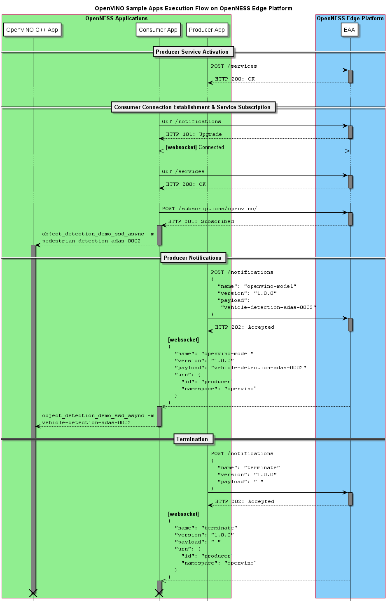

SPDX-License-Identifier: Apache-2.0
Copyright © 2019 Intel Corporation and Smart-Edge.com, Inc.

# OpenVINO Sample Application in OpenNESS
OpenVINO™ toolkit, short for Open Visual Inference and Neural network Optimization toolkit, provides improved neural network performance on Intel® processors and enables development of cost-effective and real-time vision applications. The toolkit enables deep learning inference and easy heterogeneous execution across multiple Intel® platforms (Intel® CPUs, Intel® Integrated Graphics, Intel® FPGA, Intel® Movidius™ Neural Compute Stick, Intel® Neural Compute Stick 2 and Intel® Vision Accelerator Design with Intel® Movidius™ VPUs) — providing implementations across cloud architectures to edge devices. 

Intel® Open Network Edge Services Software (OpenNESS) toolkit enables developers and businesses to easily land deep learning solutions that were optimized using OpenVINO toolkit on premises and on the network edge. Visual inference applications using OpenVINO™ are onboarded by OpenNESS for accelerated and low-latency execution on the edge.

This sample application demonstrates OpenVINO™ object detection (pedestrian and vehicle detection) deployment and execution on the OpenNESS edge platform. A live feed being received from a client device is inferred using OpenVINO pre-trained models, `pedestrian-detection-adas-0002` and `vehicle-detection-adas-0002`.

This sample application is based on OpenVINO™ toolkit 2019 R1.1 and is using the provided OpenVINO "Object Detection SSD C++ Demo - Async API" sample application with some amendments in order to work with the OpenNESS deployment. The changes are applied using the procided patch `object_detection_demo_ssd_async.patch`.

## Components

The full pipeline of the OpenVINO execution is composed of three components:

 1. Client Simulator Application — `clientsim`
 2. OpenVINO Producer Application — `producer`
 3. OpenVINO Consumer Application — `consumer`

Each component is contained in a docker container, namely: `client-sim:v1`,`openvino-prod-app:v1` and `openvino-cons-app:v1`.

### Client Simulator

Client simulator is responsible for contiuosly tranmistting a video stream up to the OpenNESS edge platform. The video traffic is steered by NTS to the concerned OpenVINO consumer application.

### OpenVINO Producer Application

OpenVINO producer application is responsible for activating a service in OpenNESS Edge Node. This service is simply a publication of the inference model name which can be used by the OpenVINO consumer application(s). This service involves sending periodic `openvino-model` notification (its interval is defined by `NotificationInterval`), which in turn is absorbed by the consumer application(s).

The producer application commences publishing notifications after it handshakes with the Edge Application Agent (EAA) over HTTPS REST API. This handshaking involves authentication and service activation.

### OpenVINO Consumer Application

OpenVINO consumer application executes object detection on the received video stream (from the client simulator) using an OpenVINO pre-trained model. The model of use is designated by the model name received in the `openvino-model` notification. The corresponding model file is provided to the integrated OpenVINO C++ application.

When the consumer application commences execution, it handshakes with EAA in a proces that involves (a) authentication, (b) websocket connection establishment, (c) service discovery, and (d) service subscription. Websocket connection retains a channel for EAA to forward notifications to the consumer application whenever a notification is received from the producer application over HTTPS REST API. Only subscribed-to notifications are forwarded on to the websocket.

### Execution flow between producer-EAA-consumer

The simplified execution flow of the consumer & producer applications with EAA is depicted in the sequence diagram below.



## Pre-requisites

The following prerequisites must be installed on the platform for a successful execution:

1. Docker
2. Go Programming Language (Golang)
3. FFmpeg (on the video visualization platform)

> **IMPORTANT:** The Internet access is required to execute the following steps successfully. If you have access to the Internet through the proxy server only, please make sure that it is configured in your environment.

> **NOTE:** If you are using Docker behind a proxy, you will need to configure your Docker client and services to use proxy settings for successfull installation and execution. Follow [Configuring Docker For Use With a Proxy](https://movidius.github.io/ncsdk/docker_proxy.html) from NCSDK Documentation.

## X.509 Certificates Generation

In order for the consumer & producer applications to work with OpenNESS edge platform over Transport Layer Security (TLS), they need to authenticate first using X.509 digital certificates.

EAA certificates should have been generated in `<appliance-parent-directory>/certs/` before building the applications docker images. The build scripts look in that directory and copy the root Certificate Authority (rootCA) key and certificate files (`rootCA.key`, `rootCA.pem`) in order to generate the key-pairs and certificates for the applications. These key-pairs and certifcates are copied into the docker images.

## Execution

Before going forward with exectution, build the docker containers first for `clientsim`, `producer` and `consumer`.

* Client Simulator

    ```shell
    cd <appliance-parent-directory>/build/openvino/clientsim
    ./build-image.sh
    ```

* Producer application

    ```shell
    cd <appliance-parent-directory>/build/openvino/producer
    ./build-image.sh
    ```

* Consumer application

    ```shell
    cd <appliance-parent-directory>/build/openvino/consumer
    ./build-image.sh
    ```

Now, the docker images should have been built successfully and ready to start. Images can be listed by executing this command:

```shell
docker image list
```

The 3 docker images should be printed as below,

```shell
library/openvino-cons-app       v1
library/openvino-prod-app       v1
library/client-sim              v1
```

1. Initiate the OpenNESS applicance

    ```shell
    cd <appliance-parent-directory>
    go run cmd/appliance/main.go
    ```

    This will bring up the appliance and EAA to listen and serve HTTPS REST API calls. This API is used by the OpenVINO edge applications to communicate with OpenNESS and initiate their operations.

2. Start OpenVINO producer container

    ```shell
    cd <appliance-parent-directory>/build/openvino/consumer
    ./run-docker.sh
    ```

    The producer application handshakes with EAA over HTTPS and commences sending the periodic `openvino-model` notification. This notification is registered with the namespace `openvino`.

3. Start OpenVINO consumer container

    The hostname of the `analytics.openness` is defined in `run-docker.sh` to map for the IP address of the platfrom where the annotated video will be visualized. If it is required to route it back to the client simulator, the IP address of it should be set in `run-docker.sh` before execution.

    ```shell
    cd <appliance-parent-directory>/build/openvino/consumer
    ./run-docker.sh
    ```

    The consumer application handshakes with EAA over HTTPS, discovers available services in `openvino` namespace and establishes a secure websocket connection to receive notifications.

    The annotated video is streamed over to the `analytics.openness` host.

4. Start client simulator

    By knowing the IP address of OpenVINO consumer container, the `openvino.openness` hostname in the `run-docker.sh` must be updated accordingly with this IP before starting. Then run:

    ```shell
    cd <appliance-parent-directory>/build/openvino/clientsim
    ./run-docker.sh
    ```

    The client simulator will start immediately to transmit the video feed.

5. Visualize the annotated video

    > **NOTE:** The platform where the video is to be visualized must have FFmpeg installed and an OS with a graphic support.

    Copy `rx-openvino-video.sdp` file and edit the line of `c=IN IP4` by adding the IP address of the platform where the video is visualized. This IP address should be exactly the same as it is of the `analytics.openness` hostname.

    Execute the below command to display the annotated video:

    ```shell
    ffplay -i rx-openvino-video.sdp
    ```

## Acceleration using Intel® Neural Compute Stick 2 (Intel® NCS 2)

> **NOTE:** Docker support is only available with Intel® Movidius™ Neural Compute SDK 2.x.

OpenVINO consumer application in its current shape, supports working working with CPU and MYRIAD plugins, but it does not automatically detect if MYRIAD device is available for use. By default, the application executes inference on CPU. In order to accelerate inference using Intel® NCS 2, the following piece of code in `<appliance-parent-directory>/build/openvino/consumer/cmd/object_detection.go` should be modified as follows:

From,
```go
cmd = exec.Command("/root/inference_engine_samples_build/intel64/Release/object_detection_demo_ssd_async",
    "-i", "udp://@:10001?overrun_nonfatal=1",
    "-m", (modelName + "/FP32/" + modelName + ".xml"))
```

To,
```go
cmd = exec.Command("/root/inference_engine_samples_build/intel64/Release/object_detection_demo_ssd_async", "-d", "MYRIAD",
    "-i", "udp://@:10001?overrun_nonfatal=1",
    "-m", (modelName + "/FP16/" + modelName + ".xml"))
```

After changing the file, rebuild the docker image using `build-image.sh` script to copy the modified program. Now, run the consumer application as normal.

```shell
cd <appliance-parent-directory>/build/openvino/consumer
./run-docker.sh
```
