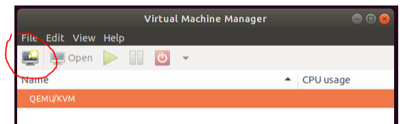
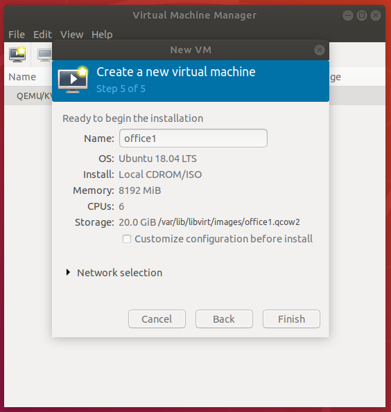
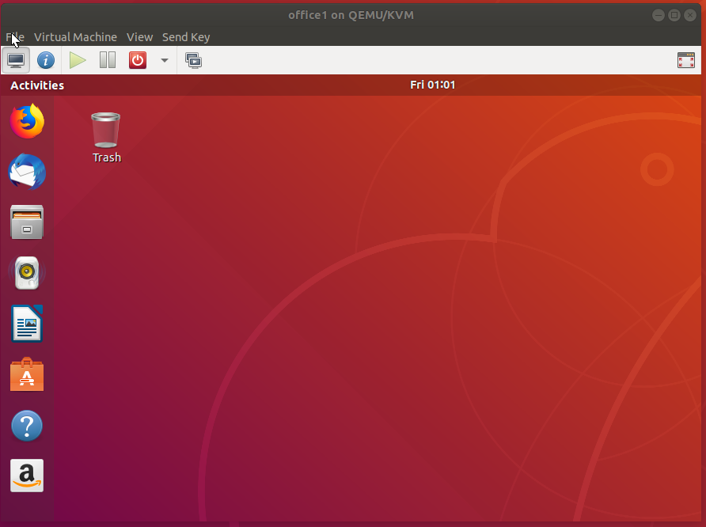

SPDX-License-Identifier: Apache-2.0
Copyright (c) 2019 Intel Corporation

# Smart City Sample Application in OpenNESS

Smart City sample application is one of the sample applications that are built on top of the OpenVINO & Open Visual Cloud software stacks for media processing and analytics. The application is deplyed across three regional offices (OpenNESS edge nodes). Each office is an aggregation point that runs multiple IP cameras (simulated) and their related analytic processing tasks. The tasks are running on the OpenNESS edge nodes for latency considerations.

The full pipeline of the Smart City sample application on OpenNESS is composed of three main ingredients:

 1. Client-side Camera Simulators
 2. Smart City Edge Applications
 3. Smart City Cloud Application

The Smart City Cloud Application presents an interactive web UI that shows a summary of the offices and the sensors (IP cameras) that connect to the offices. Cameras are dynamically discovered via the ONVIF protocol, implemented by most IP cameras.

> **Disclaimer:** The installation & bring-up steps below are preliminary. For further assistance contact Intel.

### Client-side Camera Simulators

The Smart City sample implemented camera simulation to facilitate evalaution. Camera simulation requires that you have a dataset to simulate camera feeds. The build script includes a sample clip (to be downloaded after accepting the license terms.)

If you plan to use your own dataset, put the files under `sensor/simulation`. The dataset must be a set of MP4 files, encoded with H.264 (configuration: baseline, closed-GOP and no-B-frames) and AAC.

If unsure, it is recommended that you transcode your dataset with FFmpeg, as follows:

```shell
ffmpeg -i <source>.mp4 -c:v libx264 -profile:v baseline -x264-params keyint=30:bframes=0 -c:a aac -ss 0 <target>.mp4
```

### Smart City Edge Applications

The Smart City Edge Applications implement aspects of smart city sensing, analytics and management features using Open Visual Cloud as detailed in [Smart-City-Sample GitHub](https://github.com/OpenVisualCloud/Smart-City-Sample).

### Smart City Cloud Application

The Smart City Cloud Application presents an interactive web UI that shows a summary of the offices and the sensors (IP cameras) that connect to the offices, as shown in [here](https://github.com/OpenVisualCloud/Smart-City-Sample#launch-browser).

## Build & Deployment of the Smart City Pipeline

Clone the Smart City Reference Pipeline source code from [GitHub](https://github.com/OpenVisualCloud/Smart-City-Sample.git) to the client-side machine and cloud machine.

### Smart City VM Creation

#### Create VMs with virt-manager

The VMs are created from base Ubuntu 18.04 LTS ISO image with virt-manager. The following shows how to create VM image for office1. Similarly, VM images for office2 and office3 can be also created.

On host machine, launch virt-manager



Click on the top-left button to create a new virtual machine


Select “Local install media (ISO image or CDROM), and then click the 'Forward' button.


Click “Browse” button to select the Ubuntu 18.04 LTE ISO image, and then click 'Forward' button.
The ISO file can be downloaded from https://ubuntu.com/download/desktop


Allocate Memory (RAM) and CPUs. Click 'Forward' for next step.


Enter the size of the virtual machine disk image. Click 'Forward' for next step.



Give the virtual machine name. In this example, the name is office1. Similarly, the other 2 virtual machines to be created will be assigned name office2 and office3.
By clicking 'Finish' button, virt-manager pops up the virtual machine window to walk though Ubuntu 18.04 LTS desktop setup. Finally, the virtual machine is created and launched.



#### Setup Smart City on VMs

##### 1. Create Smart City docker images.

On a development machine, follow instructions on https://github.com/OpenVisualCloud/Smart-City-Sample to build Smart City docker images.
After the images are successfully built, backup the images to tar files.

```shell
smtc@devel-machine:~/Smart-City-Sample/build$ cd ../script
smtc@devel-machine:~/Smart-City-Sample/script$ ./backup-image.sh
```

The script `backup-image.sh` saves docker image tar files to `smtc@devel-machine:~/Smart-City-Sample/archive`.

##### 2. Setup Environment for Running Smart City on VMs.

1. With virt-manager, start and login to the virtual machine.
2. Follow instructions on https://github.com/OpenVisualCloud/Smart-City-Sample to setup docker and docker swarm.
3. Clone repo of Smart City for OpenNESS [**coming...**] to virtual machine at location

```shell
vcse@smtc-office1:~/Smart-City-Sample
```

4. Copy the docker image tar files created in the previous step to virtual machine. This can be done through different ways such as ssh, NFS, etc. Assuming that the docker image files are shared at `vcse@smtc-office1:~/Smart-City-Sample/archive`.

5. Run the following command to restore Smart City docker images to virtual machine.

```shell
vcse@smtc-office1:~/Smart-City-Sample/script$ ./restore-image.sh
```

### Smart City Edge Application Deployment

Three different VMs has been created for the three regional Smart City edge applications to be deployed on the OpenNESS edge nodes. The [HTTPS server for VM image download](https://github.com/open-ness/specs/blob/master/doc/openness_howto.md#creating-https-server-for-image-download) must have been created.

Deploy the three edge application VMs must as shown in [Deploying OpenVINO application](https://github.com/open-ness/specs/blob/master/doc/openness_howto.md#deploying-openvino-application) in "OpenNESS How-To Guide" and set the traffic policies as explained in [OpenVINO Creating Traffic Rules](https://github.com/open-ness/specs/blob/master/doc/openness_howto.md#2-openvino-creating-traffic-rules) section.

The end-to-end setup should look like as in this diagram:


The green lines represents the telco dataplane network. The client, the three edge nodes and the EPC simulator belong to this network.

In this diagram, there are 3 sperate telco dataplane subnets:

1. Smart city regional office-1 subnet is `192.168.10.0/24`
2. Smart city regional office-2 subnet is `192.168.20.0/24`
3. Smart city regional office-3 subnet is `192.168.30.0/24`

The orange/red network represents the cloud network (Internet). The OpenNESS
controller manages OpenNESS edge nodes through this network. The Smart City
cloud application also connects to Smart City edge applications through this
network.

### Setting-up Smart City Applications Interfaces

Once the edge applications have been deployed, follow the below steps to set up the traffic. Similar to [OpenVINO Manual Configuration steps](https://github.com/open-ness/specs/blob/master/doc/openness_howto.md#7-openvino-manual-configuration-steps) in "OpenNESS How-To Guide".

From OpenNESS edge node 1, log in to the `smtc-office1` VM. The VM IP can be obtained by running this command `$ virsh net-dhcp-leases default`:

Inside the VM, execute the below commands to set up the dataplane network interface:

```shell
sudo ip link set dev ens3 arp off
sudo ip a a 192.168.10.20/24 dev ens3
sudo ip link set dev ens3 up
sudo wget 192.168.10.123 -Y off
```

Exit from VM shell, and execute the below commands to configure OpenNESS DNS with the dataplane `192.168.10.0/24` subnet:

```shell
docker exec -it mec-app-edgednssvr ip link set dev vEth0 arp off
docker exec -it mec-app-edgednssvr ip a a 53.53.53.53/24 dev vEth0
docker exec -it mec-app-edgednssvr ip link set dev vEth0 up
docker exec -it mec-app-edgednssvr ip route add 192.168.10.0/24 dev vEth0
docker exec -it mec-app-edgednssvr wget 192.168.10.123 -Y off
```

Repeat the above for OpenNESS edge nodes 2 & 3, by logging in to `smtc-office2` and `smtc-office3` VMs and replacing the dataplane subnets with `192.168.20.0/24` & `192.168.30.0/24` respectively.

Now, the 3 OpenNESS edge nodes are configured and ready to receive traffic from the client-side camera simulators.

### EPC Simulator Setup
EPC simulator existance is assumed by NTS. EPC must be configured with an IP that belongs to the telco dataplane network. In this deployment it will be assigned IP: `192.168.x.50`.

The three interfaces connected to the 3 subnets must be configured as below:

```shell
ifconfig enp94s0f0 up 192.168.10.50
ifconfig enp94s0f1 up 192.168.20.50
ifconfig enp94s0f2 up 192.168.30.50
```

### Client-side Camera Simulators Setup & Deployment

The three interfaces connected to the 3 subnets must be configured as below. Similar to [OpenVINO Client Simulator Setup](https://github.com/open-ness/specs/blob/master/doc/openness_howto.md#9-openvino-client-simulator-setup) section in "OpenNESS How-To Guide".

```shell
ifconfig enp94s0f0 up 192.168.10.10
arp -s 192.168.10.20 deadbeef
ifconfig enp94s0f1 up 192.168.20.10
arp -s 192.168.20.20 deadbeef
ifconfig enp94s0f2 up 192.168.30.10
arp -s 192.168.30.20 deadbeef
```

Execute the below ping commands to allow NTS to learn MAC addresses of client & EPC machines.

```shell
ping 192.168.10.20
ping 192.168.10.50
ping 192.168.20.20
ping 192.168.20.50
ping 192.168.30.20
ping 192.168.30.50
```

Now, all the machines should be ping-able. Retry pinging to all interfaces, there should be a valid reply coming back: 

```shell
ping 192.168.10.20
ping 192.168.20.20
ping 192.168.30.20
```

On the client-side machine, install `vlc` and deploy the IP-camera simulators as follows:

```shell
apt-get install -y python3-requests vlc
cd sensor/simulation
./run.sh
```

### Smart City Application Deployment & Activation

#### Smart City Cloud Application
Log in to the cloud machine and follow the link below to increase limit of nmap count:

https://www.elastic.co/guide/en/elasticsearch/reference/current/vm-max-map-count.html

Edit GatewaysPorts yes in `/etc/ssh/sshd_config` then:

```shell
systemctl restart sshd.
```

Execute the following to build & bring up the Smart City cloud application:

```shell
cd build
cmake -DNOFFICES=3 ..
make start_openness_cloud
```

#### Smart City Cameras
Log in to the camera machine and execute the following to build & bring up the simulated cameras:

```shell
cd build
cmake -DNOFFICES=3 ..
make start_openness_camera
```

#### Smart City Edge Applications
Log in to the Smart City Edge applications and execute the following steps in order to start the smart city pipeline on edge node 1:

1. Increase limit of nmap count https://www.elastic.co/guide/en/elasticsearch/reference/current/vm-max-map-count.html
2. Set environment variables
3. Establish passwordless SSH access and secure tunnel. The followings are examples

```shell
ssh-keygene
ssh-copy-id $CLOUDHOST
ssh -f -N -R ‘*:9301:*:9301’ $CLOUDHOST
ssh -f -N -R ‘*:18081:*:18081’ $CLOUDHOST
```

4. Start office1 on corresponding VM

```shell
make start_openness_office1
```

Similarly, for node 2,

1. Increase limit of nmap count https://www.elastic.co/guide/en/elasticsearch/reference/current/vm-max-map-count.html
2. Set environment variables
3. Establish passwordless SSH access and secure tunnel. The followings are examples

```shell
ssh-keygene
ssh-copy-id $CLOUDHOST
ssh -f -N -R ‘*:9302:*:9302’ $CLOUDHOST
ssh -f -N -R ‘*:18082:*:18082’ $CLOUDHOST
```

4. Start office2 on corresponding VM

```shell
make start_openness_office2
```

And for node 3,

1. Increase limit of nmap count https://www.elastic.co/guide/en/elasticsearch/reference/current/vm-max-map-count.html
2. Set environment variables
3. Establish passwordless SSH access and secure tunnel. The followings are examples

```shell
ssh-keygene
ssh-copy-id $CLOUDHOST
ssh -f -N -R ‘*:9303:*:9303’ $CLOUDHOST
ssh -f -N -R ‘*:18083:*:18083’ $CLOUDHOST
```

4. Start office3 on corresponding VM

```shell
make start_openness_office3
```
