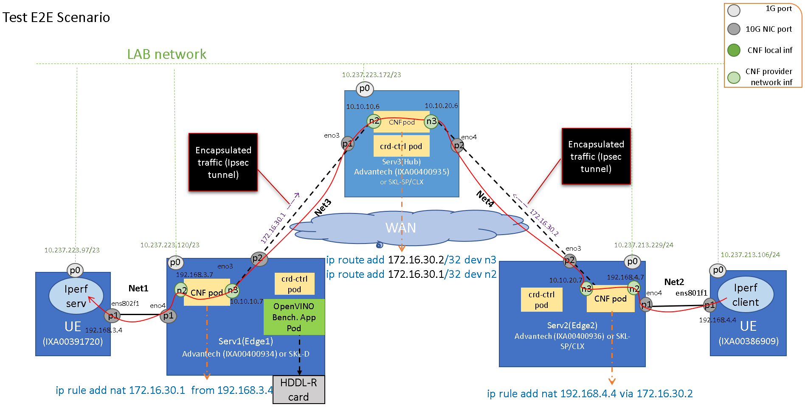

```text
SPDX-License-Identifier: Apache-2.0
Copyright (c) 2020 Intel Corporation
```
<!-- omit in toc -->
# E2E Scenario
Reference architecture E2E network topology based SDEWAN.

- [Introduction](#introduction)
  - [SDEWAN](#SDEWAN)
  - [ovn4nfv-k8s-plugin](#ovn4nfv-k8s-plugin)
- [Full Path Traffic Flow](#full-path-traffic-flow)
- [Deployment](#deployment)
  - [UE1](#ue1)
  - [UE2](#ue2)
  - [HUB](#hub)
    - [Deploy OpenNESS](#deploy-openness)
    - [Deploy EDEWAN Controller](#deploy-edewan-controller)
    - [Configure Network](#configure-network)
    - [Start CNF](#start-cnf)
    - [Setup Tunnel and Rules](#setup-tunnel-and-rules)
  - [EDGE1](#edge1)
    - [Deploy OpenNESS](#deploy-openness-1)
    - [Deploy EDEWAN Controller](#deploy-edewan-controller-1)
    - [Configure Network](#configure-network-1)
    - [Start CNF](#start-cnf-1)
    - [Setup Tunnel and Rules](#setup-tunnel-and-rules-1)
  - [EDGE2](#edge2)
    - [Deploy OpenNESS](#deploy-openness-2)
    - [Deploy EDEWAN Controller](#deploy-edewan-controller-2)
    - [Configure Network](#configure-network-2)
    - [Start CNF](#start-cnf-2)
    - [Setup Tunnel and Rules](#setup-tunnel-and-rules-2)
- [Testing](#testing)
  - [Resource Consumption](#resource-consumption)
  - [Network Performance](#network-performance)

## Introduction

OpenNESS integrates SDEWAN and ovn4nfv-k8s-plugin to enable secure, tunneled connections between Edge cluster and WAN, and inter cluster connections through WAN.

### SDEWAN
Software Defined Edge WAN(SDEWAN), is designed to support Corp networks to connect to external internet with security connection. The SDEWAN module acts as a software defined router which can be used to define the rules for connecting Edge clusters to the external internet (WAN). It provides the capabilities of multiple WAN management: WAN interfaces management, outbound traffic rules, traffic load balancing etc.

### ovn4nfv-k8s-plugin
ovn4nfv-k8s-plugin is a CNI plugin based on ovn. It can work together with Multus CNI to add multiple interfaces for the pod. One of the interfaces is the Multus default interface, it could be flannel, calico, etc. The other interfaces are added by ovn4nfv-k8s-plugin according the pod annotation. With ovn4nfv-k8s-plugin, we can create virtual network in run-time. Also, we can connect the pod with the provider network, this is important for SDEWAN CNF.




> Figure 1 - Network Topology

## Full Path Traffic Flow

The above picture shows one of sdewan scenarios in OpenNESS. In the scenario, there are 2 UEs connected to two separate edges which are connected to one common hub. It shows the traffic flow from one UE to the other UE via hub. Currently it is just a basic connectivity function without SFC.

We deploy OpenNESS on both edges and the hub. On each edge and hub, we setup a sdewan controller and CNF. Then we setup an IPsec tunnel between the edge and the hub. Each CNF is connected to two provider networks.

Currently the UE connects to the CNF directly without switch/Router. In the picture, UE1 is in the same network(NET1) as edge1 port.  It is considered as a private network. In order to access the other UE, its UE IP is mapped to the interface IP of Edge node's CNF, (such as, P1 of UE1 map to n3 of CNF on edge1.  This can be considered as a floating IP address, and we can re-map this IP to any UE.

On edge1 we also setup an OpenVINO app, currently, it only does local benchmark. In later release, we can support remote benchmark, maybe it can connect to a RTSP camera UE.

## Deployment

Currently, there's automation script(for example ansible to setup all these 5 servers. But there are some scripts to facilitate the deployment process.

We can deploy in this order, first 2 UEs, then hub at last 2 edges.
On all the three servers we should download the edgeapp repository and setup the global network topology variables.

   ```
   GIT_HTTP_PROXY=http://proxy-mu.intel.com:911
   GIT_USER=YouGitName
   git clone https://github.com/otcshare/edgeapps.git \
   --config "http.proxy=$GIT_HTTP_PROXY" \
   --config "credential.username=$GIT_USER"

   APP_PATH=edgeapps/network-functions/sdewan_cnf/e2e-scenarios/three-single-node-clusters
   sh $APP_PATH/global_network_topology.sh
   source ~/.profile

   ```

### UE1

Setup the IP of interface. Please make sure the right interface is connected to edge1.
We can use this command to check the interface status:

   ```
   nmcli -p dev
   DEVICE    TYPE      STATE         CONNECTION
   ----------------------------------------------------------------------
   ens786    ethernet  connected     System ens786
   ens802f1  ethernet  disconnected  --
   ```

Suppose the right interface name is eth10, then configure the interface IP as follow:

   ```
   INTERFACE=eth10
   PREFIX=24
   IPADDR=$UE1_P1
   source $APP_PATH/utils.sh
   genifcfg
   ```

Configure router rule for UE1 as follow:

   ```
   sh $APP_PATH/ue1/set_rules.sh
   ```

### UE2

Suppose the right interface name is eth10, then configure the interface IP as follow:

   ```
   INTERFACE=eth10
   PREFIX=24
   IPADDR=$UE2_P1
   source $APP_PATH/utils.sh
   genifcfg
   ```

Configure router rule for UE2 as follow:

   ```
   sh $APP_PATH/ue2/set_rules.sh
   ```

### HUB

#### Deploy OpenNESS

Firstly, set the reserved CPUs for system before deployment:

   ```
   EXPECTID=0
   HT_SIBLINGS=`cat /sys/devices/system/cpu/cpu$EXPECTID/topology/thread_siblings_list`  # 0,8
   CORE_SIBLINGS=`cat /sys/devices/system/cpu/cpu$EXPECTID/topology/core_siblings_list`  # 0-15
   RESERVED=$HT_SIBLINGS
   [[ ! $HT_SIBLINGS =~ "," ]] && RESERVED=${CORE_SIBLINGS//-/,}
   sed -i -e 's/reserved_cpus:.*/reserved_cpus: "'"$RESERVED"'"/' flavors/sdewan-hub/all.yml
   ```

Please use "sdewan-hub" flavor to deploy OpenNESS.

   ```
   ./deploy_ne.sh -f sdewan-hub single
   ```

#### Deploy EDEWAN Controller

Make sure "edgeapps" is your current directory.

   ```
   http_proxy=$GIT_HTTP_PROXY ./edgeapps/applications/sdewan_ctrl/pre-install.sh
   cd ./edgeapps/applications/
   helm install sdewan-ctrl ./sdewan_ctrl/chart/sdewan-crd-ctrl/
   cd -
   ```

#### Configure Network

Create 2 provider networks for the CNF.

   ```
   sh $APP_PATH/hub/provider_network.sh
   ```

#### Start CNF

Start the CNF with the above provider networks.

   ```
   SDEWAN_CNF_PRE=./edgeapps/network-functions/sdewan_cnf/pre-install.sh
   CNF_NODE=$(kubectl get nodes -o name | tail -n 1)
   sed -i -e "s/\(.*CNF_NODE=\).*/\1${CNF_NODE##*\/}/" $SDEWAN_CNF_PRE
   grep -n3 "CNF_NODE=" $SDEWAN_CNF_PRE
   sh $SDEWAN_CNF_PRE

   sh $APP_PATH/hub/start_cnf.sh
   ```

#### Setup Tunnel and Rules

NOTE: Currently the CRD does not support this kind of rules in our scenario. So, we set the rules in the CNF directly.

   ```
   sh $APP_PATH/hub/setup_tunnel.sh
   sh $APP_PATH/hub/set_tunnel_rules.sh
   ```

### EDGE1

#### Deploy OpenNESS

Firstly, set the reserved CPUs for system before deployment:

   ```
   EXPECTID=0
   HT_SIBLINGS=`cat /sys/devices/system/cpu/cpu$EXPECTID/topology/thread_siblings_list`  # 0,8
   CORE_SIBLINGS=`cat /sys/devices/system/cpu/cpu$EXPECTID/topology/core_siblings_list`  # 0-15
   RESERVED=$HT_SIBLINGS
   [[ ! $HT_SIBLINGS =~ "," ]] && RESERVED=${CORE_SIBLINGS//-/,}
   sed -i -e 's/reserved_cpus:.*/reserved_cpus: "'"$RESERVED"'"/' flavors/sdewan-edge/all.yml
   ```

Please use "sdewan-edge" flavor to deploy OpenNESS.

   ```
   ./deploy_ne.sh -f sdewan-edge single
   ```

#### Deploy EDEWAN Controller

Make sure "edgeapps" is your current directory.

   ```
   http_proxy=$GIT_HTTP_PROXY ./edgeapps/applications/sdewan_ctrl/pre-install.sh
   cd ./edgeapps/applications/
   helm install sdewan-ctrl ./sdewan_ctrl/chart/sdewan-crd-ctrl/
   cd -
   ```

#### Configure Network

Create 2 provider networks for the CNF.

   ```
   sh $APP_PATH/edge1/provider_network.sh
   ```

#### Start CNF

Start the CNF with the above provider networks.

   ```
   SDEWAN_CNF_PRE=./edgeapps/network-functions/sdewan_cnf/pre-install.sh
   CNF_NODE=$(kubectl get nodes -o name | tail -n 1)
   sed -i -e "s/\(.*CNF_NODE=\).*/\1${CNF_NODE##*\/}/" $SDEWAN_CNF_PRE
   grep -n3 "CNF_NODE=" $SDEWAN_CNF_PRE
   sh $SDEWAN_CNF_PRE

   sh $APP_PATH/edge1/start_cnf.sh
   ```

#### Setup Tunnel and Rules

Set Tennel

   ```
   sh $APP_PATH/edge1/setup_tunnel.sh
   ```

Set Rules

We can set the rules in the CNF directly or by CR, they are alternative. Recommend to set rule by CR in production environment. Setting in CNF directly can be used for debug.

In CNF setting:

   ```
   sh $APP_PATH/edge1/set_tunnel_rules.sh
   ```

By CR

   ```
   sh $APP_PATH/dge1/crd_tunnel_rules.sh
   ```

### EDGE2

#### Deploy OpenNESS

Firstly, set the reserved CPUs for system before deployment:

   ```
   EXPECTID=0
   HT_SIBLINGS=`cat /sys/devices/system/cpu/cpu$EXPECTID/topology/thread_siblings_list`  # 0,8
   CORE_SIBLINGS=`cat /sys/devices/system/cpu/cpu$EXPECTID/topology/core_siblings_list`  # 0-15
   RESERVED=$HT_SIBLINGS
   [[ ! $HT_SIBLINGS =~ "," ]] && RESERVED=${CORE_SIBLINGS//-/,}
   sed -i -e 's/reserved_cpus:.*/reserved_cpus: "'"$RESERVED"'"/' flavors/sdewan-edge/all.yml
   ```

Please use "sdewan-edge" flavor to deploy OpenNESS.

   ```
   ./deploy_ne.sh -f sdewan-edge single
   ```

#### Deploy EDEWAN Controller

Make sure "edgeapps" is your current directory.

   ```
   http_proxy=$GIT_HTTP_PROXY ./edgeapps/applications/sdewan_ctrl/pre-install.sh
   cd ./edgeapps/applications/
   helm install sdewan-ctrl ./sdewan_ctrl/chart/sdewan-crd-ctrl/
   cd -
   ```

#### Configure Network

Create 2 provider networks for the CNF.

   ```
   sh $APP_PATH/edge2/provider_network.sh
   ```

#### Start CNF

Start the CNF with the above provider networks.

   ```
   SDEWAN_CNF_PRE=./edgeapps/network-functions/sdewan_cnf/pre-install.sh
   CNF_NODE=$(kubectl get nodes -o name | tail -n 1)
   sed -i -e "s/\(.*CNF_NODE=\).*/\1${CNF_NODE##*\/}/" $SDEWAN_CNF_PRE
   grep -n3 "CNF_NODE=" $SDEWAN_CNF_PRE
   sh $SDEWAN_CNF_PRE

   sh $APP_PATH/edge2/start_cnf.sh
   ```

#### Setup Tunnel and Rules

Set Tennel

   ```
   sh $APP_PATH/edge2/setup_tunnel.sh
   ```

Set Rules

We can set the rules in the CNF directly or by CR, they are alternative. Recommend to set rule by CR in production environment. Setting in CNF directly can be used for debug.

In CNF setting:

   ```
   sh $APP_PATH/edge2/set_tunnel_rules.sh
   ```

By CR

   ```
   sh $APP_PATH/dge2/crd_tunnel_rules.sh
   ```

## Testing

### Resource Consumption

Intall metrics server components.

   ```
   sh $APP_PATH/resource_consumption.sh
   ```
Get memory and CPU consumption
   ```
   kubectl top pod -A --sort-by memory
   ```

### Network Performance

Login EDGE1 to get the tunnel overlay IP, it is a floating ip that maps iperf3 server ip.

   ```
   IPNET=`kubectl exec -it  $CNFPOD -- ip a | grep ${O_UE2_IP%.*} | awk '{match($0, /.+inet\s([^ ]*)/, a);print a[1];exit}'`
   IPERF_SERVER=${IPNET%%/*}
   echo $IPERF_SERVER
   ```

Login UE1 and start iperf3 server.

   ```
   IPERF_SERVER=$UE1_P1     # IPERF_SERVER, it is UE1 interface IP
   sh $APP_PATH/ue1/iperf_server.sh
   ```

Login UE2 and start iperf3 client.

   ```
   IPERF_SERVER=xx.xx.xx.x  # IPERF_SERVER get from EDGE1
   sh $APP_PATH/ue2/iperf_client.sh
   ```
